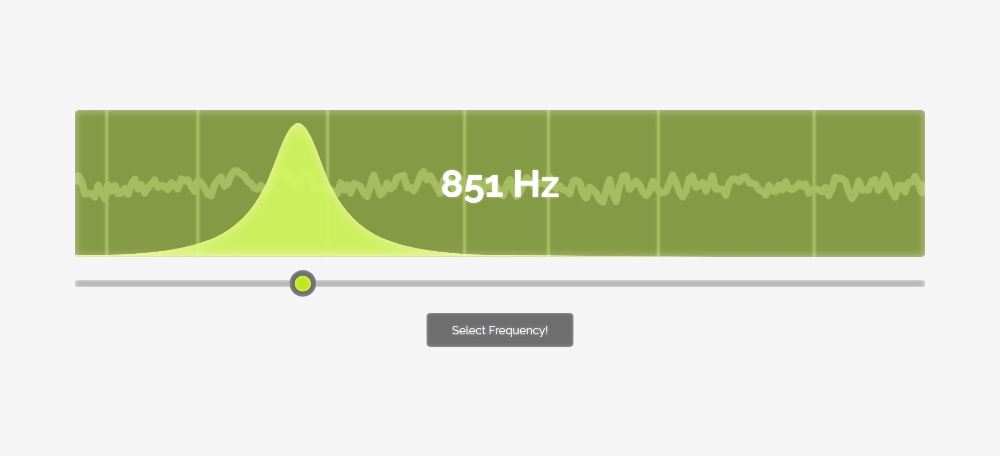

# eq-trainer

Train yourself to recognize frequencies by listening to a pink noise sample and estimating its boosted frequency. Inspiration from [this video](https://www.youtube.com/watch?v=0fckQLQWhe0) by Audio University.

[Live demo can be found here.](https://lenzrivera.github.io/eq-trainer)

## Potential Future Additions
- Using other audio files apart from pink noise
- Better animations
- Optimization for lower-end devices (glow effects don't come cheap)
- Circumventing the fact that paremeters can't be passed into svg filters (why two separate but identical Wave components are used)